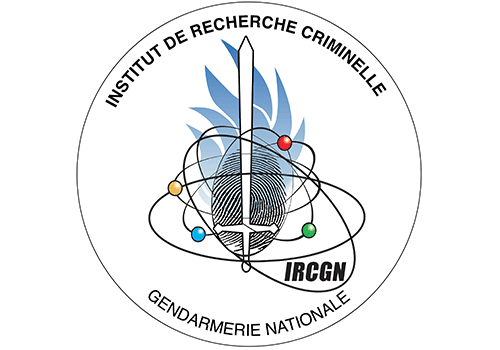

In collaboration with <a href="https://github.com/pierrelabendzki" target="_blank">Pierre Labendzki</a>

Deepfake generation built with a decoder. 

This application takes a video as input, extracts the faces present in it and extracts the chosen characteristics: opening between the lips, facial expression, orientation of the head (Euler's angle) and size of the boundary box (masks of faces in order to remove background).

The facial expression is done with a <a href="https://github.com/WuJie1010/Facial-Expression-Recognition.Pytorch " target="_blank">CNN</a>.

When the features are gathered, we can use our decoder to generate images based on the faces extracted from the video.



