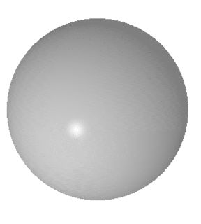
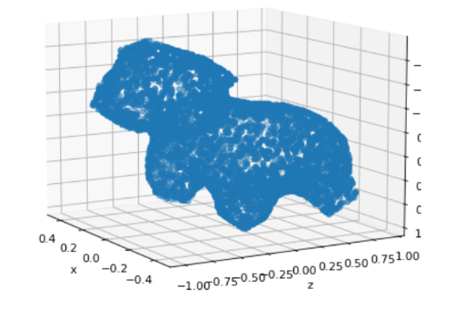

In collaboration with <a href="https://github.com/dsmtE" target="_blank">Enguerrand De Smet</a>

Deforming meshes can be used to represent a collection of objects with different shapes and poses. Meshes may differ in their number of vertices, faces and their topology. 

Such heterogeneity makes it difficult to efficiently implement batched operations on 3D data using operators provided by standard deep learning toolkits like `PyTorch` and `Tensorflow`. In our case study, as we use the library `PyTorch3D`, the mesh is a `load_obj` which is a file format containing the description of a 3D geometry. 

We draw on state of the art methods for 3D shape prediction to build a mesh deformation system. 
This project is based on <a href="https://github.com/clinplayer/3DModelingRL" target="_blank">3DModelingRL</a> that is the source code for the ECCV 2020 paper <a href="https://arxiv.org/abs/2003.12397" target="_blank">Modeling 3D Shapes by Reinforcement Learning</a>

We wrote a <a href="../../assets/file/StyleTransfer.pdf" target="_blank"> paper </a> that explains into more details our approach.

We are featured on <a href="https://paperswithcode.com/paper/modeling-3d-shapes-by-reinforcement-learning" target="_blank">papers with code</a> !



