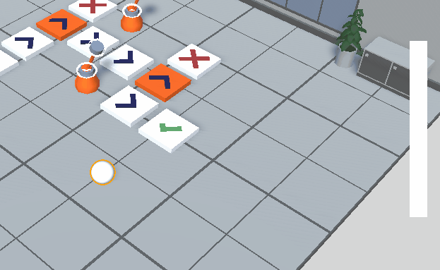

In collaboration with <a href="https://github.com/guillaume-haerinck" target="_blank">Guillaume Haerinck</a>

The theme for the Ludum dare 53 was "Delivery". You can see our submission <a href="https://ldjam.com/events/ludum-dare/53/harmless-delivery" target="_blank">here</a>.
What I find interesting about Ludum dare is that participants vote and leave comments. It's a great way to improve, both by seeing the positives and the negatives.

You’re an employee at the local post center and your job is to dispatch the packages via the conveyor belt.
The problem ? You don’t have arms and the controls are hidden behind shut doors. You will have to use your brain (and your feet) to quickly find a way inside the control room in order to set the proper path before the package is sent to the wrong destination.

This game was done with Unity 2022.2.



