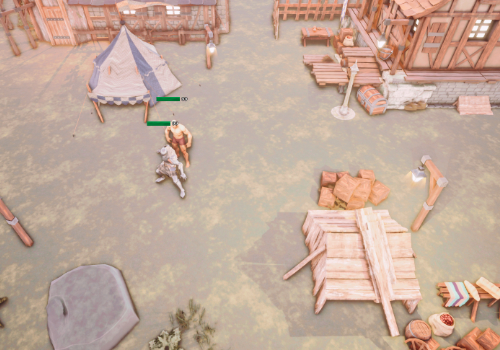
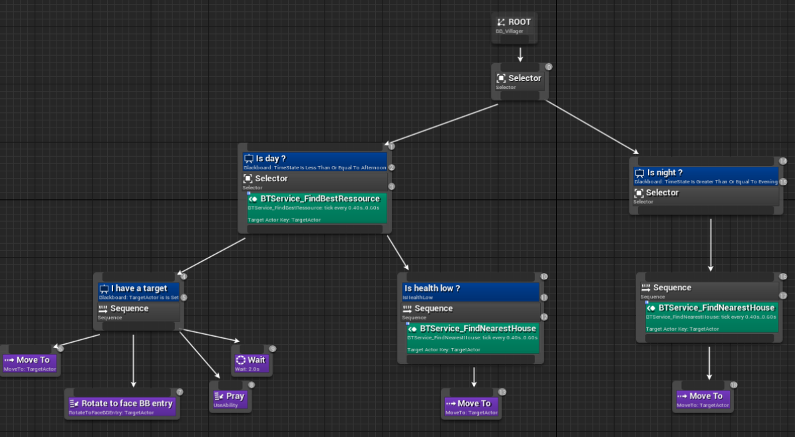

# Evil Age

In collaboration with <a href="https://github.com/guillaume-haerinck" target="_blank">Guillaume Haerinck</a>

AI simulation of a medieval village being attacked each night by a horde of monsters. 
Depending on the biomes used to create the village and the actions of the player it will hold more or less night before being decimated.

Check out our <a href="https://docs.google.com/document/d/1moc4p_B_iT_EEBIlR9h2R_dH93v3kneCevpFhrRHHZ0/edit?usp=sharing" target="_blank">game design document</a>

Evil Age use the gameplay ability system which is a plugin to ease the building of abilities like health management, damage, powerful skill, buff and attribute system. It has been used in AAA games such as Paragon, Gears Tactics and Fortnite among others. It cannot be used without a bit of C++. Therefore, this is not an only blueprint project!

<i>The behavior tree of a monster</i>

Check out our <a href="https://docs.google.com/document/d/1moc4p_B_iT_EEBIlR9h2R_dH93v3kneCevpFhrRHHZ0/edit?usp=sharing" target="_blank">game design document</a>



