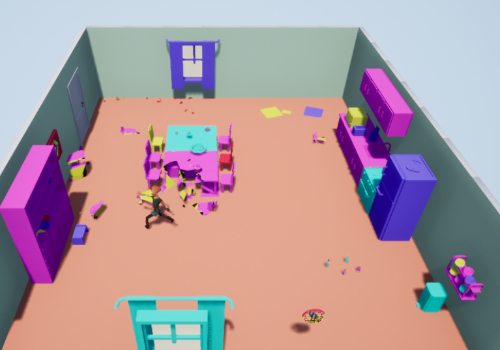

In collaboration with <a href="https://github.com/guillaume-haerinck" target="_blank">Guillaume Haerinck</a>

The theme for the GGJ 2021 was "Lost and found". 

As a key finder, your role is to find keys that have been lost in your client's apartment and the only way to find them fast enough is to break things. Your goal is to break as few things as possible and to find the key as fast as possible. Playable alone or with someone!

This game was done with Unreal Engine 4 with the Chaos Destruction system. 



