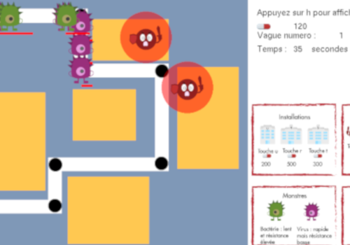
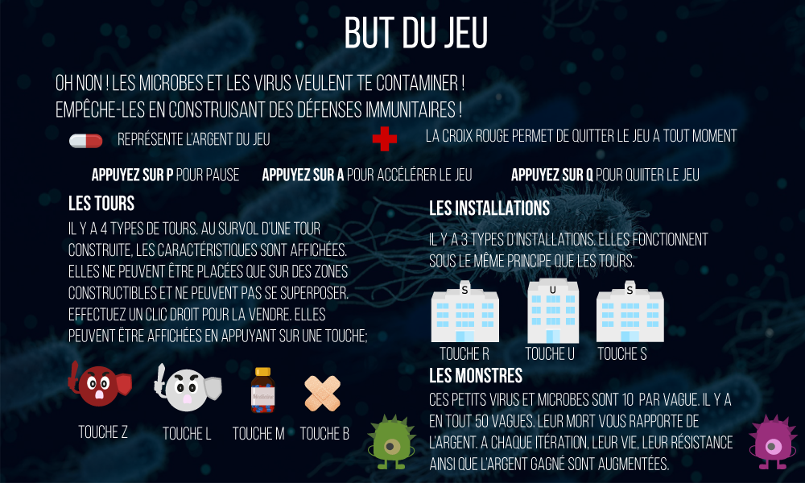

In collaboration with <a href="https://github.com/ClawsDevlp" target="_blank">Clara Daigmorte</a>

Don't want to be contaminated by bacteria and viruses? This is your chance to defend yourself! Create defences like medicine to fight this infamies!

Development of a tower defense theme based on the cartoon "Once Upon a Time... Life"



