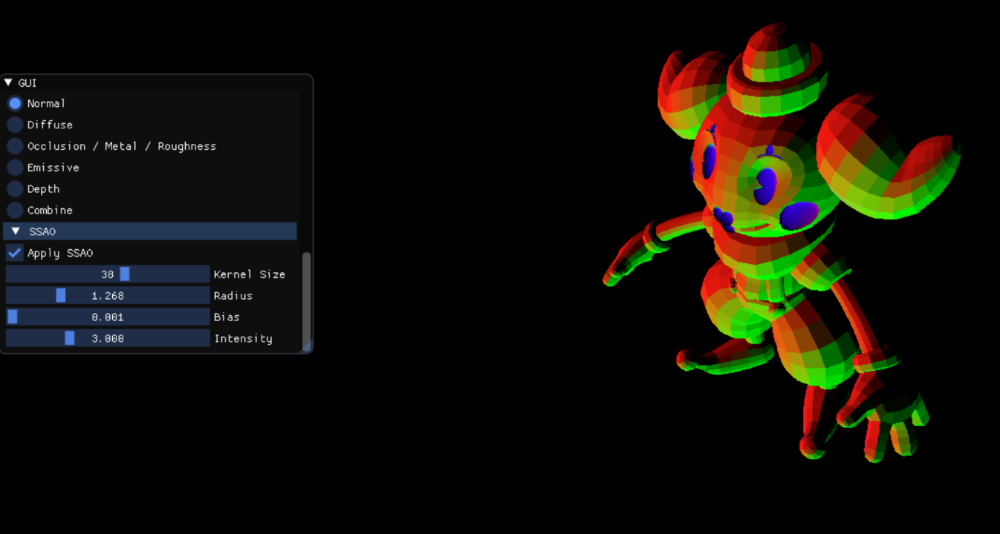

During the lessons, I had to follow different steps <a href="https://gltf-viewer-tutorial.gitlab.io/" target="_blank"> written by our teacher </a> and find implementation solutions. The exercices consisted of reading the gltf data to display it, controlling the camera, controlling the directional light and applying materials to the loaded 3d object.

We were then left to do the project on our own. I implemented normal mapping, depth maps, deferred rendering and SSAO. In the project, you can change all thoses variables via the interface created with IMGUI. I was really happy to do this project, it was the first time I went this far with OpenGL and was able to use RenderDoc to debug myself. In particular, I used the well-known Sponza 3D scene to test my different functionalities.



